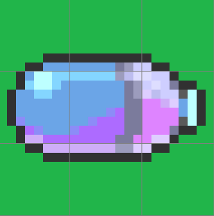
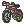
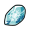

| Item Name | Route | Specific Location | Method | Requirements |
            | :--- | :--- | :--- | :--- | :--- |
            |  Ability Pill | Postwick | Talk to Mum in your house. | 	Once per day, Mum will give you a random item from a list of 15 items. |  |
|  Armor Pass | Wedgehurst | Sonias Lab | Speak with Leon after completing the game to get the Armor Pass | Beat Leon in the championship. |
|  Crown Pass | Isle Of Armor Dojo | Dojo | After completing the story of the Isle of Armor, Battle honey to get the Crown Pass | Complete Isle of Armor |
|  Cutter | Wild Area 4 East | Old woman with Morpeko stuck on cliff. | Go through Wild Areas 5 and 6 and through Rixy Chamber to reach the stuck Morpeko. After rescuing it, you will be rewarded with the Cutter item. | 5 Badges |
|  Dive Goggles | Circhester | Crystal Hotel | Talk to Penny to receive the Dive Goggles | 5 Badges |
|  Dynamax Band | Route 2 | Magnolia's House | Obtain as part of the story |  |
|  Fly Map | Route 3 | Sonia will give you the Fly Map outside the entrance to Galar mine 1 on Route 3. |  |  |
|  Link Cable | Wild Area 4: South | NPC selling evolution items  | Buy |  |
|  Rotom Bike | Route 5 | Save man from Team Yell. | Defeat Team Yell Grunts | 1 Badge |
|  Rotom Phone | Wedgehurst | Sonia's Lab | Get from Sonia to start your journey! |  |
|  Rusty Shield | Slumbering Area | Zamazenta holding this item | Capture Zamazenta | 8 badges |
|  Rusty Shield | Freezington (Crown Tundra) | NPC Vender outside Train Station | Purchase from Vender | Isle of Armor Completed |
|  Rusty Sword | Slumbering Area | Zacian holding this item. | Capture Zacian | 8 Badges |
|  Rusty Sword | Freezington (Crown Tundra) | NPC Vender outside the Train Station | Purchase from Vender | Isle of Armor Completed |
|  Water Bike | Route 9 | Save the man from Team Yell to upgrade your bike to the Water Bike. | Defeat Team Yell. | 6 Badges |
|  Z Ring | Wild Area 1 North | Old man near the bridge and entrance to Motostoke. | Find, battle, defeat, and return the Mudsdale in Wild Area 3 North to the old man. |  |
|  Zygarde Cell | Route 2 | Up the hill to the right, near the Cyndaquil Trade. | Interact with sparkles |  |
|  Zygarde Cell | Route 3 | North path on the route, near the Shinx NPC trade. | Interact with sparkles |  |
|  Zygarde Cell | Galar Mine 1 | Across the water in the cave. | Interact with sparkles | Surf |
|  Zygarde Cell | Route 5 | Down the hill, above the pond. | Interact with sparkles | 1 Badge |
|  Zygarde Cell | Motostoke East | South of the Galar Mine 2 Exit, on the water. | Interact with sparkles | Surf |
|  Zygarde Cell | Wild Area 3 West | All the way north on the route. | Interact with sparkles | 3 Badges |
|  Zygarde Cell | Wild Area 5 (Desert) South | All the way south in the desert. | Interact with sparkles | 4 Badges |
|  Zygarde Cell | Stow-On-Side | On the roof, left side of the city. | Interact with sparkles | 3 Badges |
|  Zygarde Cell | Glimwood Tangle | Near the Ballonlea exit of the Glimwood Tangle. behind some cut trees or over some water. | Interact with sparkles | Surf/Cutter |
|  Zygarde Cell | Courageous Cavern (Route 10) | In side of the Courageous Cavern on Route 10, drop down through the holes and find the Cells. | Interact with sparkles | 8 Badges |
|  Deep Sea Tooth | Wild Area 3 South | NPC Vender | Purchase from Vender | 3 Badges |
|  Electirizer | Wild Area 3 South | NPC Vender | Purchase from Vender | 3 Badges |
|  Fire Stone | Wild Area 3 South | NPC vender | Purchase from NPC | 3 Badges |
|  Good Rod | Ballonlea | Left-most house in Ballonlea | Talk to fisherman NPC |  |
|  Ice Stone | Wild Area 3 South | NPC Vender | Purchase from Vender | 3 Badges |
|  Magmarizer | Wild Area 3 South | NPC vender | Purchase from Vender | 3 Badges |
|  Mega Ring | Motostoke | House Nearest Budew Drop Inn | Battle Bianca and win in a 1 on 1 battle | Using only 1 Pokémon, defeat Bianca's level 25 Mega-Altaria |
|  Metal Coat | Wild Area 3 South | NPC Vender | Purchase from Vender | 3 Badges |
|  Moon Stone | Wild Area 3 South | NPC Vender | Purchase from Vender | 3 Badges |
|  Old Rod | Postwick | Top of stairs in your room when starting a new game. |  |  |
|  Shiny Charm | Postwick | Your house, from Mum. | Talk to your mum. Once per day she will give you an item. That item can be a shiny charm. |  |
|  Sun Stone | Wild Area 3 South | NPC Vender | Purchase from NPC | 3 Badges |
|  Super Rod | Route 9 | On a snow island towards the right side of route 9 | Talk to fisherman NPC |  |
|  Water Stone | Wild Area 3 South | NPC Vender | Purchase from Vender | 3 Badges |
|  Zygarde Cube | Turffield | Top left most house NPC. | Speak with this NPC after capturing Zygarde. | Capture Zygarde. |

            