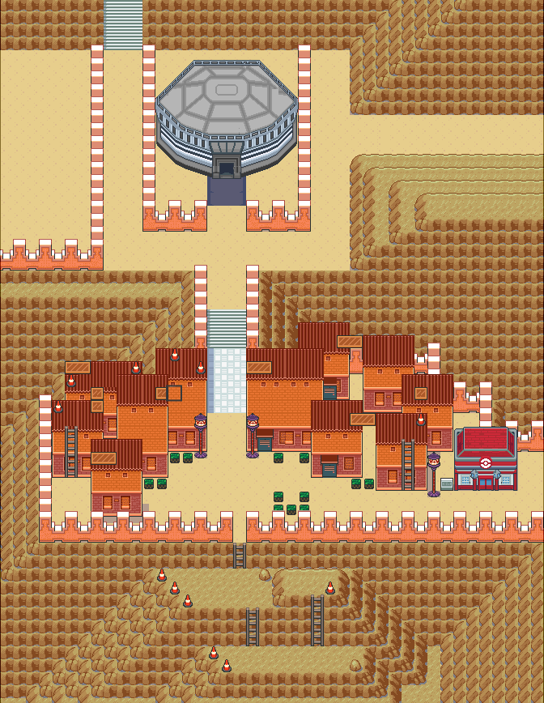

=== "Wild Encounters"

	???+ note "Gift Lv. 35"
		

                     [Falinks](/sword-and-shield-ultimate-plus-wiki/pokemon/870-falinks) 100%
                

	???+ note "In Game Trade Lv. 10"
		

                     [Snivy](/sword-and-shield-ultimate-plus-wiki/pokemon/495-snivy) 100%
                

                     [Tepig](/sword-and-shield-ultimate-plus-wiki/pokemon/498-tepig) 100%
                

	???+ note "Legendary"
		

                     [Deoxys-speed](/sword-and-shield-ultimate-plus-wiki/pokemon/386-deoxys-speed) 100%
                

                     [Deoxys-attack](/sword-and-shield-ultimate-plus-wiki/pokemon/386-deoxys-attack) 100%
                

                     [Mega-rayquaza](/sword-and-shield-ultimate-plus-wiki/pokemon/384-mega-rayquaza) 100%
                

                     [Deoxys-defense](/sword-and-shield-ultimate-plus-wiki/pokemon/386-deoxys-defense) 100%
                

