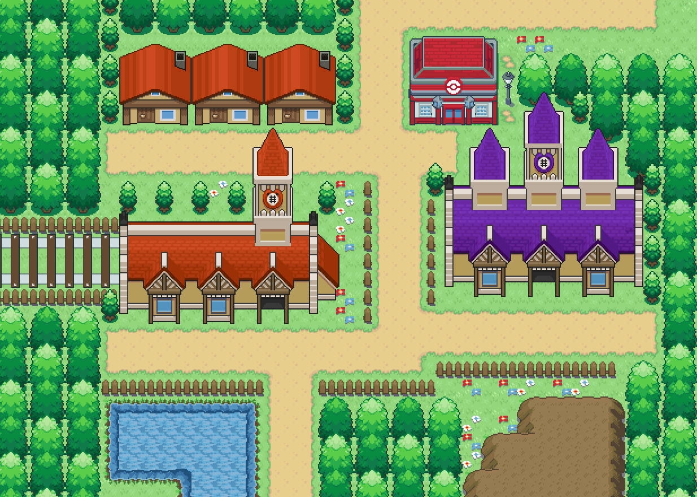

=== "Wild Encounters"

	???+ note "Gift Lv. 15"
		

                     [Grookey](/sword-and-shield-ultimate-plus-wiki/pokemon/810-grookey) 100%
                

                     [Sobble](/sword-and-shield-ultimate-plus-wiki/pokemon/816-sobble) 100%
                

                     [Scorbunny](/sword-and-shield-ultimate-plus-wiki/pokemon/813-scorbunny) 100%
                

	???+ note "In Game Trade Lv. 10"
		

                     [Chikorita](/sword-and-shield-ultimate-plus-wiki/pokemon/152-chikorita) 100%
                

	???+ note "Overworld Lv. 30"
		

                     [Slowpoke-galarian](/sword-and-shield-ultimate-plus-wiki/pokemon/079-slowpoke-galarian) 100%
                

